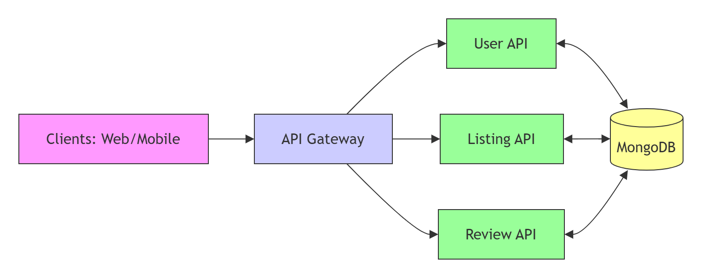

# CampusSwap API

CampusSwap is a platform designed for university students to exchange, buy, or sell campus-related items efficiently. This API serves as the backend service for the CampusSwap ecosystem.

## Author Information
- **Name:** C.P.Imashi Fernando
- **Index Number:** [ITBIN-2313-0033]

---

## Table of Contents
- [About](#about)
- [System Architecture](#system-architecture)
- [Technologies](#technologies)
- [Features](#features)
- [Getting Started & Local Setup](#getting-started--local-setup)
- [API Endpoints](#api-endpoints)
- [CI/CD Pipeline](#cicd-pipeline)
- [Key Challenges & Solutions](#key-challenges--solutions)
- [Future Improvements](#future-improvements)
- [License](#license)
- [Live Demo](#livedemo)
- [Technical Status](technicalstatus)
- [Docker Deployment](dockerdeployment)
- [Troubleshooting / Known Issues](troubleshooting / known Issues]

---

## About
CampusSwap aims to create a sustainable campus community by allowing students to easily find and trade items such as textbooks, electronics, and study materials. This API manages user authentication, listing management, and review systems.

## System Architecture
The system follows a clean architecture structure:
- **Clients:** Web/Mobile applications.
- **Gateway:** Central entry point for API routing and security.
- **APIs:** Core Spring Boot services handling business logic.
- **DBS:** MongoDB for flexible, document-based data storage.

**Architecture Diagram:**

## Technologies
- **Language:** Java (JDK 21)
- **Framework:** Spring Boot
- **Database:** MongoDB
- **Containerization:** Docker & Docker Compose
- **Build Tool:** Maven

## Features
- **User Authentication:** Secure registration and login using JWT.
- **Listing Management:** Create, update, delete, and search for campus items.
- **Review System:** Users can rate and review items/sellers.
- **Dockerized Environment:** Fully containerized setup for consistency.

---

## Getting Started & Local Setup

### Prerequisites
- Java JDK 21, Maven, Docker Desktop.

### Installation & Running
1. **Clone:** `git clone https://github.com/imashi368/CampusSwap.git`
2. **Configure:** Add `application.properties` (with MongoDB connection string) in `src/main/resources/`.
3. **Build:** `mvn clean install`
4. **Run:** `docker-compose up --build`

---

## API Endpoints (Core)

| Method | Endpoint | Description |
| :--- | :--- | :--- |
| `POST` | `/api/auth/register` | Register new student |
| `POST` | `/api/auth/login` | Login and get token |
| `GET` | `/api/listings` | Fetch all items |
| `POST` | `/api/listings` | Add new item |
| `POST` | `/api/reviews` | Review item/seller |

---

## CI/CD Pipeline
Uses **GitHub Actions** for automated build and test cycles on every push.

---

## Key Challenges & Solutions
1. **Database Integration:** Switching to MongoDB for dynamic schema management.
2. **Git Security:** Sensitive connection strings protected using `.gitignore`.
3. **Docker Networking:** Resolved communication between Spring Boot and MongoDB containers via Docker Compose.

---

## Future Improvements

### 1. Message Queues
- Implementation of **RabbitMQ** or **Apache Kafka** for asynchronous tasks (e.g., email notifications).

### 2. Analytics
- Integration of **Google/Firebase Analytics** to track user engagement and popular item trends.

---

## License
Distributed under the MIT License.

---

## Live Demo
[CampusSwap App](https://my-campusswap-app.onrender.com/)

---

## Technical Status
Due to an ongoing technical configuration issue with the cloud database connection, this live demo is currently partially functional. The complete, fully functional version of the application is available and verified in the local development environment.

---

## Docker Deployment
This project is containerized for consistent deployment. You can access the Docker Hub repository here:(https://hub.docker.com/repositories/i0703721005)

---
## Troubleshooting / Known Issues
**Database Connection:**
The application is successfully containerized and runs as expected. The `Connection refused` error observed in the logs is due to network restrictions on the local environment preventing access to the cloud-hosted MongoDB Atlas instance. This does not indicate any issues with the application code or the Dockerization process.
